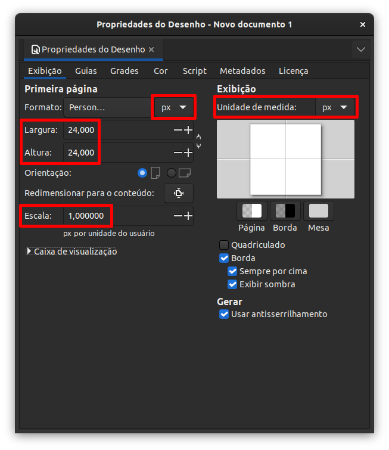

# square-badges

Coleção de badges referentes a tecnologias, ícones, frameworks e o que mais for interessante para dar *aquele tapa no visual* do seu readme. O :dart: objetivo deste repositório é fornecer ícones (preferencialmente com aspect ratio 1:1) nas medidas de 24, 36 e 48px em formato `.svg` .

  

## Como contribuir :construction:

Aqui sempre haverá espaço para **qualquer um** que esteja disposto a ajudar, principalmente Designers :wink: :art: rsrs. Atualmente estou utilizando o software [inkscape](https://inkscape.org/) para desenvolver as artes, entretanto, sinta-se a vontade para usar a ferramente que mais lhe agradar, lembrando sempre do próposito do repositório que visa a entrega no formato `.svg`.

  
 Setup inkscape 

  <h4>Configurações do documento</h4>

  Ao abrir o inkscape > novo documento. Ou usando o atalho do teclado `ctrl` + `shift` + `D` e utilize as seguintes configurações destacadas em vermelho conforme imagem abaixo.

  

  

## Tech-badges

| tech | icon | 
| :---: | :---: |
| C | |
| C++ |  |
| C# | |
| Java |  |
| HTML5 |  |
| CSS3 |  |
| JavaScript |  |
| React js |  |
| Jest |  |
| React testing library |  |
| Redux |  |
| Typescript |  |
| Python |  |
| php |  |